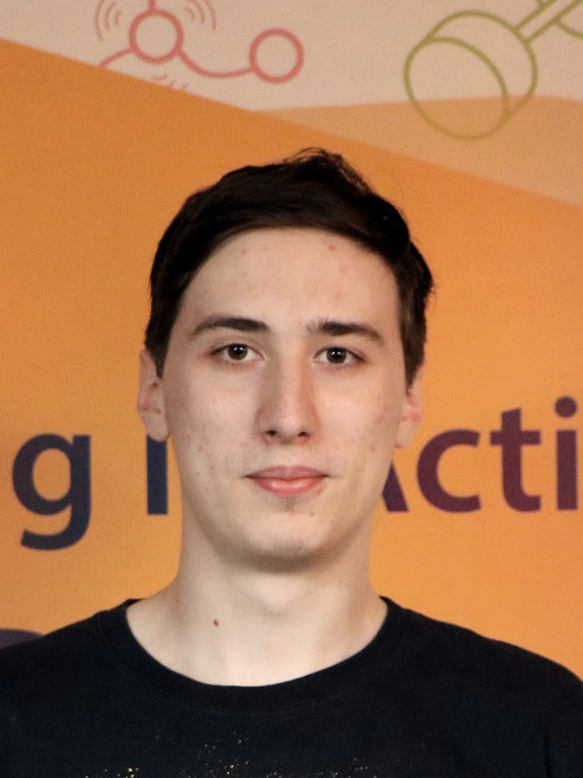

## Maslovich Nikolay Romanovich

### Bio
Bachelor @ NUST MISiS, Moscow  
Applied Math

Have ended phys-math faculty Lyceum #1525 Vorobievy Gory, '14

### Activity
Non-working, looking for vacancies in the sphere of Deep/Machine Learning  
At free time doing pet projects, see my repo

### ML achievements
- Have passed Andrew NG's Deep Learning Coursera Specialization: [Certificate](https://www.coursera.org/account/accomplishments/specialization/M3MJ77GFCWL8)
- Have passed Victor Kantor's [Data Mining in Action course](https://vk.com/data_mining_in_action) fall'17 @ RUDN university, Moscow
- Have [attended](https://yadi.sk/i/kzR6EO893URs3D) Microsoft DevCon Conference (Neural networks track)

### Science achievements
- [The publication](https://yadi.sk/i/Ro-I3MYG3XkgEa)1 @ [ICSA conference '18](http://2018.icsa-conf.ru/) and the [certificate for the best report](https://yadi.sk/i/fYwFokJC3Xkcz8) in the section
- The publication @ [NUST MISiS's collection of theses](https://yadi.sk/i/sgdDJNyj3XkdXC)
- [The 2nd place](https://yadi.sk/i/4F4kw6Ht3XkczN) in the [NUST MISiS's competition of scientific videos](https://www.youtube.com/watch?v=HhI_K5cVi2o)
- Have [attended](https://yadi.sk/i/CRqTjhNs3URAdq) [ISYT](http://isyt2017.spiiras.nw.ru/) IV-th International Summer School-Seminar on Artificial Intelligence '17

### Special Skills
- IELTS band 7.0: [Certificate](https://yadi.sk/i/qfsGN3GR3URAdd)
- Have passed Samsung Practice (Tizen, Web): [Certificate](https://yadi.sk/i/9C2lsIiv3URAdf)
- Have [participated](https://yadi.sk/i/FdyetOGP3URAdm) in Visionhack hackathon

### Programming languages
- Python
- JavaScript
- C#
- R

### DL/ML Frameworks
- Keras & Tensorflow
- MxNet
- PyTorch
- sklearn & pandas & scipy & numpy

### Contact me
- [Telegram](https://t.me/maslovich)
- [VK](https://vk.com/realign)
- [Email](mailto:m141836@edu.misis.ru)

1 - Информатика, управление и системный анализ: Труды V Всероссийской научной конференции молодых ученых с международным участием. - Ростов-на-Дону: Мини-Тайп, 2018. - 500 с.
